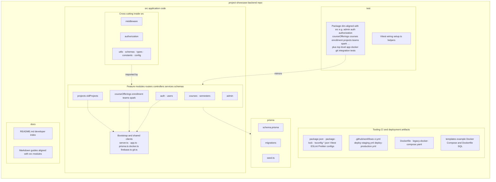
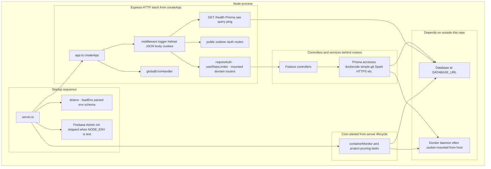
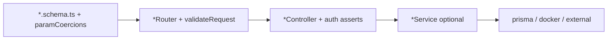

# Developer documentation index

This directory holds **module guides** aligned with folders under [`src/`](../src/): purpose, responsibilities, patterns, routes, testing, and how to extend safely.

Operational setup—environment variables, Docker Compose, data volumes, deployment flags—is in the repository root **[`README.md`](../README.md)**. Use that for day-one setup; use these docs for **how code is structured** and **where to edit**.

---

## Repository shape

Here is where the pieces of **`project-showcase-backend`** live, and how they relate at a glance.

### What sits at the repo root (besides source)

| Area | Typical paths | Role |
|------|----------------|------|
| **Application** | [`src/`](../src/) | Express API: feature folders, middleware, schemas, singleton clients |
| **Data model & migrations** | [`prisma/`](../prisma/) (`schema.prisma`, `migrations/`, [`seed.ts`](../prisma/seed.ts)) | Database contracts and repeatable schema changes |
| **Tests** | [`test/`](../test/), [`vitest.config.ts`](../vitest.config.ts) | Vitest suites (structure mirrors [`src/`](../src/) domains; shared [`setup.ts`](../test/setup.ts) and [`helpers/`](../test/helpers/)) |
| **Module docs** | This folder ([`docs/`](./)) | Markdown guides keyed to [`src/`](../src/) domains |
| **CI/CD** | [`.github/workflows/`](../.github/workflows/) | Build, test, and deploy pipelines |
| **Container build** | [`Dockerfile`](../Dockerfile), [`legacy-docker-compose.yaml`](../legacy-docker-compose.yaml) | Backend image / legacy Compose reference |
| **Examples for student projects** | [`templates/`](../templates/) | Sample Docker Compose / Dockerfiles referenced from ops docs |

Root config/tooling shared by scripts and editors includes **`package.json`**, **`tsconfig*.json`**, ESLint/Prettier, and **`package-lock.json`**.

See **[`core.md`](./core.md)** for how [`server.ts`](../src/server.ts), [`app.ts`](../src/app.ts), and singleton files at the **`src/`** root fit together.

### Directory map (what lives next to what)

Boxes are logical groupings—not every file name is listed. Feature names match folders under **`src/`** and mirrored areas under **`test/`**.

**How to read the dashed arrows**

- **Cross-cutting `src/` layers → features** — `middleware`, `authorization`, and **`utils` / `schemas` / `types` / `constants` / `config`** are imported by routers and controllers; most are not their own HTTP subtrees (**`/auth`** is the notable public subtree from **`auth`**).

- **Feature modules → `prisma/`** — domain code persists via **Prisma** using models in [`schema.prisma`](../prisma/schema.prisma).

- **Feature modules → bootstrap clients (`prisma.ts`, `docker.ts`, `firebase.ts`, `git.ts`)** — **`auth`** uses Firebase, **`projects`** uses Docker plus Git clones, and most DB access goes through **`prisma`** (see **`core`** for specifics).

- **`test/` → mirrors `src/`** — a [`test/`](../test/) package directory usually exercises the matching **`src/`** module (HTTP tests compose [`createApp()`](../src/app.ts) from **`app.ts`**, not **`server.ts`**).

### Runtime layering (single process)

When **`npm run dev`** / **`npm start`** runs [`server.ts`](../src/server.ts), one Node process wires HTTP handling, cron-style background checks, and external integration clients like this:

**Background jobs:** [`containerMonitor`](../src/projects/containerMonitor.ts) (and related pruner helpers in the same area) reconcile **database `Project` state** with **live containers**—see **`projects`** and **`core`** docs for shutdown behavior.

---

## Request lifecycle

1. **Middleware (global):** [`requestLogger`](../src/middleware/logger.ts) → Helmet → JSON body (`1mb`) → cookie parser  
2. **Public routes:** `GET /health`, `router.use('/auth', authRouter)`  
3. **Authenticated stack:** [`requireAuth`](../src/middleware/authentication.ts) (Bearer JWT) → [`userRateLimiter`](../src/middleware/rateLimit.ts)  
4. **Domain routers:** [`/admin`](../src/admin/adminRouter.ts) additionally uses [`requireAdmin`](../src/middleware/authentication.ts) at mount time  
5. **Errors:** [`globalErrorHandler`](../src/middleware/errorHandler.ts)

---

## Module documentation

| Topic | Doc | `src/` path |
|--------|-----|--------------|
| App bootstrap, DB, Docker, Firebase, Git | [core.md](./core.md) | `app.ts`, `server.ts`, `prisma.ts`, `docker.ts`, `firebase.ts`, `git.ts` |
| HTTP middleware stack | [middleware.md](./middleware.md) | [`middleware/`](../src/middleware/) |
| Env validation | [config.md](./config.md) | [`config/`](../src/config/) |
| Shared Zod route params | [schemas.md](./schemas.md) | [`schemas/`](../src/schemas/) |
| Roles and project statuses | [constants.md](./constants.md) | [`constants/`](../src/constants/) |
| Express `Request` augmentation | [types.md](./types.md) | [`types/`](../src/types/) |
| Errors + shared helpers | [utils.md](./utils.md) | [`utils/`](../src/utils/) |
| Offering / team guards | [authorization.md](./authorization.md) | [`authorization/`](../src/authorization/) |
| Firebase login → JWT | [auth.md](./auth.md) | [`auth/`](../src/auth/) |
| Current user profile | [users.md](./users.md) | [`users/`](../src/users/) |
| Catalog courses (admin CRUD) | [courses.md](./courses.md) | [`courses/`](../src/courses/) |
| Semesters | [semesters.md](./semesters.md) | [`semesters/`](../src/semesters/) |
| Course offerings (enrollment boundary) | [courseOfferings.md](./courseOfferings.md) | [`courseOfferings/`](../src/courseOfferings/) |
| Enrollments | [enrollment.md](./enrollment.md) | [`enrollment/`](../src/enrollment/) |
| Teams | [teams.md](./teams.md) | [`teams/`](../src/teams/) |
| Cornell Spark keys | [spark.md](./spark.md) | [`spark/`](../src/spark/) |
| Project deploy/containers | [projects.md](./projects.md) | [`projects/`](../src/projects/) |
| Legacy builders | [oldProjects.md](./oldProjects.md) | [`oldProjects/`](../src/oldProjects/) |
| Platform admin API | [admin.md](./admin.md) | [`admin/`](../src/admin/) |

---

## Common development commands

| Command | Purpose |
|---------|---------|
| `npm run dev` | Watch mode: `nodemon -x tsx src/server.ts` |
| `npm run build` | `tsc` compile to `dist/` |
| `npm start` | Production: `node dist/server.js` |
| `npm test` | Vitest (`test/setup.ts` loads env defaults) |
| `npm run lint` | ESLint on `src/` and `test/` |
| `npm run seed` | `tsx prisma/seed.ts` |

---

## Adding an HTTP endpoint (typical pattern)

1. Extend or add **Zod** schema (often import [`paramCoercions`](../src/schemas/paramCoercions.ts) for ID params).
2. Register route on the **Router** with `validateRequest(schema)`.
3. Implement handler in **Controller** (`req.user`, `req.validated`).
4. Enforce **authorization** with guards in [`authorization/`](../src/authorization/) or [`authorizationHelpers`](../src/utils/authorizationHelpers.ts), or [`requireAdmin`](../src/middleware/authentication.ts).
5. Move non-trivial logic to **Service** modules.
6. Add **HTTP tests** under `test/` (see [`test/helpers/signTestJwt.ts`](../test/helpers/signTestJwt.ts), [`test/helpers/prismaMock.ts`](../test/helpers/prismaMock.ts)).

For enrollment-scoped URLs, start with **[`courseOfferings.md`](./courseOfferings.md)**, **[`enrollment.md`](./enrollment.md)**, **[`teams.md`](./teams.md)**, and **[`authorization.md`](./authorization.md)**.
