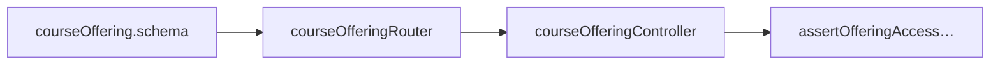

# Course offerings (`src/courseOfferings/`)

## Overview

**Semester instantiation** of a catalog course (**`CourseOffering`**). This module is the **enrollment boundary** for most learner workflows: roster management, nested teams endpoints, Spark key routing subtree, bulk project tagging orchestration hooks, Offering **locks**, and persisted JSON **settings**.

Most learner-facing URLs therefore nest **`/course-offerings/:offeringId`** so enrollment and guards always have **`offeringId`** in sync with [`courseOfferingRouter.ts`](../src/courseOfferings/courseOfferingRouter.ts).

## File layout

| File | Responsibility |
|------|----------------|
| [`courseOfferingRouter.ts`](../src/courseOfferings/courseOfferingRouter.ts) | Mounts enrollment + nested teams + spark |
| [`courseOfferingController.ts`](../src/courseOfferings/courseOfferingController.ts) | HTTP adapters + authorization composition |
| [`courseOfferingService.ts`](../src/courseOfferings/courseOfferingService.ts) | Cascading deletes, lock orchestration (**Prisma transactional chunks**) |
| [`courseOffering.schema.ts`](../src/courseOfferings/courseOffering.schema.ts) | Param/body/query Zod schemas |
| [`courseOfferingSettings.ts`](../src/courseOfferings/courseOfferingSettings.ts) | Settings side-effects (**visibility**, etc.—see source) |
| [`courseOfferingSettingsSchema.ts`](../src/courseOfferings/courseOfferingSettingsSchema.ts) | Parse/normalize **`settings`** JSON blob |

Spark router mount reuses **`mergeParams: true`** (**[spark](./spark.md)**).

Tagging invokes **[`projectTagService`](../src/projects/projectTagService.ts)** (**[projects](./projects.md)**).

## How it fits

Mounted at **`/course-offerings`** (**after global auth**).

## API surface highlights (`/course-offerings`)

> Exact handler-level authorization nuances live in **`courseOfferingController`**—this table summarizes shape.

| Method | Path segment | Typical auth policy |
|--------|---------------|-----------------------|
| `GET` | `/` | Scoped listing (**admin sees all**) + optional **`?role=`** filter (**validate query**) |
| `POST` | `/` | **Admin** (**`requireAdmin`**) creates offering |
| `GET` | `/:offeringId` | Enrolled identities per settings |
| `PUT` | `/:offeringId` | Instructors/teaching updates settings |
| `DELETE` | `/:offeringId` | Admin deletion (**service cleanup**) |
| `POST` | `/:offeringId/lock` | Locks deployment/runtime surface (**paired with unlock**) |
| `POST` | `/:offeringId/unlock` | Inverse |
| `GET|POST` | `/:offeringId/enrollments` | Roster (**write** instructors/staff semantics) (**[enrollment](./enrollment.md)**) |
| `PUT|DELETE` | `/:offeringId/enrollments/:userId` | Adjust roles / drop row |
| `GET|POST` | `/:offeringId/teams` | Collection listing + create (**delegates **`teamController`** ) |
| `GET` | `/:offeringId/teams/me` | Personalized membership slice |
| *Spark subtree* | `/:offeringId/spark/*` | See **`spark`** |
| `POST` | `/:offeringId/projects/tag` | Bulk docker tag orchestration (**[projects](./projects.md)** service) |
| `DELETE` | `/:offeringId/projects/tag` | Remove tagging configuration |

Use **`courseOfferingParamsSchema`** / **`courseOfferingTeamsParamsSchema`** plus **[paramCoercions](./schemas.md)**.

Settings mutations call **`processCourseOfferingSettings`** (or equivalent naming in module) ensuring JSON side-effects stay centralized.

## Development guide

Typical **`add-an-endpoint`** flow (**[README index](./README.md)**):

1. Decide if URL remains offering-scoped (preferred).
2. Add Zod pieces (params/query/body) & import **`validateRequest`**.
3. Compose **`authorization/courseOfferingGuards`** assertions with correct **policy literal** (**`anyEnrollment`**, **`instructorOnly`**, **`teachingStaff`**).
4. Complex cleanup belongs in **`courseOfferingService`** (transaction safety).
5. If touching **`settings`** JSON schema, dual-update **`courseOfferingSettingsSchema`** + **`courseOfferingSettings` processor**.

## Related cross-links

Teams aggregate routes (**`/teams/:teamId`**) pair with nested listing—see **[teams](./teams.md)** and **[authorization](./authorization.md)**.

## Authorization

Prefer **`authorization/courseOfferingGuards`** (**[authorization](./authorization.md)**) over ad hoc Prisma.

Admin-only creation/deletion leverages **`requireAdmin`**.

## Testing

| File |
|------|
| [`test/courseOfferings/courseOfferingRouter.http.test.ts`](../test/courseOfferings/courseOfferingRouter.http.test.ts) |
| [`test/courseOfferings/courseOfferingService.test.ts`](../test/courseOfferings/courseOfferingService.test.ts) |
| [`test/courseOfferings/courseOfferingSettings.test.ts`](../test/courseOfferings/courseOfferingSettings.test.ts) |
| [`test/courseOfferings/courseOfferingSettingsSchema.test.ts`](../test/courseOfferings/courseOfferingSettingsSchema.test.ts) |

## Related docs

- [enrollment.md](./enrollment.md)
- [teams.md](./teams.md)
- [spark.md](./spark.md)
- [projects.md](./projects.md)
