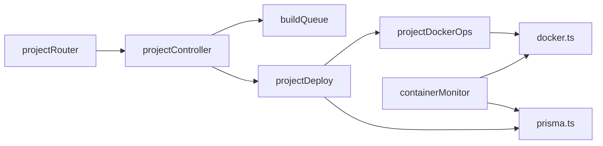

# Projects (`src/projects/`)

## Overview

End-to-end **student project deployments**: clone a Git repo, **`docker build`**, reconcile prior containers/images, persist **`Project`** rows through status transitions, optionally upload **datasets** into bind-mounted paths, expose **streaming build/runtime logs**, expose **bulk Docker image tagging**, and reconcile live Docker reality with cron-driven background tasks.

Infrastructure assumptions: **`dockerode`** connects to local Docker (often via mounted **`/var/run/docker.sock`** in Compose), deployments occur on effectively **single-replica hosts** (**`buildQueue`** is process-local).

## File layout

| File | Responsibility |
|------|----------------|
| [`projectRouter.ts`](../src/projects/projectRouter.ts) | HTTP surface + **`multer`** upload wiring |
| [`projectController.ts`](../src/projects/projectController.ts) | Request glue, SSE/log streaming adapters, invokes services + queue |
| [`project.schema.ts`](../src/projects/project.schema.ts) | Zod payloads for deploy/stop/logs/etc. |
| [`projectQueries.ts`](../src/projects/projectQueries.ts) | Read/query helpers (**`getProjectById`**, listings) |
| [`projectDeploy.ts`](../src/projects/projectDeploy.ts) | Clone → build → persist → run container (**`deploy`**, streaming siblings) |
| [`projectDockerOps.ts`](../src/projects/projectDockerOps.ts) | Network creation, **`runProjectContainer`**, teardown prior conflicting containers |
| [`projectStop.ts`](../src/projects/projectStop.ts) | Stop/kill authoritative rules + authorization |
| [`projectStreams.ts`](../src/projects/projectStreams.ts) | Docker **`logs()`** streams + persisted build log slicing |
| [`projectPaths.ts`](../src/projects/projectPaths.ts) | Map uploaded temp paths **host/container** mounts (`DATA_MOUNT_PATH = /var/www`) |
| [`projectContainerEnv.ts`](../src/projects/projectContainerEnv.ts) | Merge **`TeamEnvironment` PRODUCTION** values + **`VITE_*` build-arg** resolution |
| [`buildQueue.ts`](../src/projects/buildQueue.ts) | `MAX_CONCURRENT_BUILDS` cap with queue backlog notifications |
| [`containerService.ts`](../src/projects/containerService.ts) | **`stopAndRemoveContainer`**, scoped cleanup batches |
| [`containerMonitor.ts`](../src/projects/containerMonitor.ts) | Cron: inspect containers, prune stale workloads, backoff strategy |
| [`projectTagService.ts`](../src/projects/projectTagService.ts) | Course-offering **`OfferingTag`** + Docker tagging (**`tagCourseOfferingProjects`**, removal variant) |
| [`projectService.ts`](../src/projects/projectService.ts) | Barrel re-export of split modules for convenient imports |

`projectService.ts` is **not** a single giant class—it **re-exports** the split units above.

### Module dependency sketch

## How it fits

- Mounted in [`app.ts`](../src/app.ts) under **`/projects`** (**plus** **`/projects/legacy`** mounts [**oldProjects**](./oldProjects.md)).
- [`server.ts`](../src/server.ts) launches **[`containerMonitor.ts`](../src/projects/containerMonitor.ts)** cron jobs after DB connect (**pruner** sibling in same module).
- Team deployment slugging uses **`utils/teamAlias`**, selection of “best” exposed project leverages **`utils/projectUtils`**.

## API surface (`/projects`)

All routes inherit **authenticated JWT** + **`userRateLimiter`** from **`app.ts`**.

| Method & path | Middleware / notes | Typical purpose |
|---------------|--------------------|----------------|
| **`POST /projects/deploy`** | `multer.single('dataFile')` + **`deployProjectSchema`** | multipart deploy (JSON-compatible fields bundled in multipart where applicable—see router) |
| **`POST /projects/deploy-streaming`** | same upload + schema | streamed progress variant |
| **`GET /projects/`** | — | aggregate listing |
| **`GET /projects/:projectId`** | **`projectParamsSchema`** | project detail |
| **`POST /projects/:projectId/stop`** | **`stopProjectSchema`** | stop containers + DB status |
| **`POST /projects/:projectId/redeploy`** | **`redeployProjectSchema`** | restart from persisted image/metadata |
| **`GET /projects/:projectId/logs`** | **`streamProjectLogsSchema`** | runtime log streaming (**SSE**/streaming response in controller) |
| **`GET /projects/:projectId/build-logs`** | **`streamBuildLogsSchema`** | persisted build transcripts |
| **`GET /projects/team/:teamId`** | **`getTeamProjectsSchema`** | per-team deployments |

Uploader stores files under **`DATA_FILES_DIR`** (defaults **`/app/data/project-data-files`**) ensuring directory exists **at router import**.

## Major subsystems

### Deploy pipeline (`projectDeploy.ts`)

Rough sequence (read source for branching):

1. Verify **Team** (+ offering linkage) exists.
2. Parse **course offering settings** (**`serverLocked`**) combining admin bypass + **`checkTeachingStaffAccess`** semantics.
3. Merge **build arguments** (**`resolveDockerBuildArgs`**): PRODUCTION **`VITE_*` team vars + optional request **`extraEnvVars`** (**`VITE_*`**) + **`buildArgs`** from body.
4. Create **`Project`** row with **`PROJECT_STATUS.BUILDING`** snapshot fields.
5. Clone GitHub checkout to **`/tmp/project-<timestamp>-<repo>`** via **`simple-git`** ([**`git.ts`**](core.md)).
6. **`docker.buildImage`** with logs captured for DB **`buildLogs`**.
7. Compose container naming + alias via **`dockerDeploymentSlugForTeam`**.
8. **`ensureProjectsNetwork()`** (**`PROJECTS_NETWORK` bridge**) then **`runProjectContainer`** attaches volumes / env merges.

Concurrency: enqueue long builds through **`buildQueue`** (**`MAX_CONCURRENT_BUILDS`** env, default **`2`**).

Streaming variant surfaces incremental status via controller helpers.

### Runtime execution (`projectDockerOps.ts`)

- Ensures **`projects_network`** exists (creates on **404 inspect** failures).
- Stops/removes conflicting legacy containers (**same container name collisions** historically).
- Stops sibling **RUNNING** projects for **same team** before launching another instance (serialized team runtime).
- Binds **`dataFile`** RO mounts (**`projectPaths`** maps host upload path ↔ in-container **`/var/www/<originalName>`**, actual mount wiring in **`runProjectContainer`** body).

Environment assembly: **`buildContainerEnv(teamId)`** merges **PRODUCTION scoped** **`TeamEnvironment`** rows + flattened **`extraEnvVars`**.

### Stopping projects (`projectStop.ts`)

Combines **`NotFound`** / **`BadRequest`** guards with **fine-grained auth**:

- Always allow **admins**.
- Respect **locked offerings** analogous to deployments (students blocked while locked unless teaching staff semantics apply).
- Non-admins otherwise require **membership OR teaching staff** depending on branch.

### Streams (`projectStreams.ts`)

- **`streamProjectLogs`**: Validates container exists (**`inspect`**) → returns Docker **`logs()`** stream (controller attaches to SSE or raw streaming).
- **`streamBuildLogs`**: Pulls sanitized newline split from **`Project.buildLogs`**.

### Tagging orchestration (`projectTagService.ts`)

Triggered from **course offering** routers (**[courseOfferings](./courseOfferings.md)** bulk tag endpoints):

- Validates tag uniqueness per offering (**`OfferingTag`** table).
- For each team's **preferred** project (**`getTeamPreferredProject`**), retag **`docker`** images deterministically (**slug** derivation).
- Creates **`ProjectOfferingTag`** junction rows (**plus** syncing legacy **`Project.tag`** compatibility field).

### Background maintenance (`containerMonitor.ts`)

| Concern | Role |
|---------|-----|
| **Status polling** | Reconcile DB vs Docker (**running → stopped**) with exponential-ish backoff tiers |
| **Pruner** | Daily cleanup trimming older/stopped workloads |

Started from **`server.ts`**—extend shutdown hooks whenever adding new cron jobs.

### Auxiliary cleanup helpers (`containerService.ts`)

Higher-level transactional flows (delete teams/offerings elsewhere) call **`cleanupTeamContainers`** / **`cleanupCourseOfferingContainers`** to release Docker resources uniformly.

### Build queue (`buildQueue.ts`)

Supports **SSE position updates**, **cancellation** by queued task id, and emits periodic **`POSITION_UPDATE_MS` (`15s`)** backlog heartbeats only while waiting.

Treat as **volatile** queue state (**lost on crash / ignores multi-replica**).

## Authorization callouts

- Deploy/stop respect **locked offering** semantics + **JWT** identity.
- Some controller paths call **`authorizationHelpers`** for teaching staff parity with deploy/stop.
- Prefer extending existing predicates before adding standalone Prisma lookups.

Offering-scoped resources (teams, roster, Spark) nest under **`/course-offerings/:offeringId`**; **`/projects`** stays mostly flat (**[teams](./teams.md)**, **[courseOfferings](./courseOfferings.md)**).

## Data files & uploads

| Variable | Role |
|-----------|-----|
| `DATA_FILES_DIR` | Container-visible upload staging directory (**multer.destination**) |
| `DATA_FILES_HOST_DIR` | If set, rewires host-side bind-mount mapping via **`getHostDataFilePath`** |

Mounted read-only dataset path **`/var/www`** inside containers (**`DATA_MOUNT_PATH`**) pairs with **`getContainerDataFilePath`**.

Operational **`curl`** examples live in **[`README.md`](../README.md)**.

### `VITE_*` merging

Frontend embed-time variables (**Vite**) must exist during **`docker build`**. Merge order nuances are documented repository-wide in **[`README.md`](../README.md)** (section “Vite and `VITE_*` variables”).

## Testing

| Test file | Covers |
|-----------|--------|
| [`test/projects/projectRouter.http.test.ts`](../test/projects/projectRouter.http.test.ts) | HTTP smoke |
| [`test/projects/projectService.test.ts`](../test/projects/projectService.test.ts) | Barrel / exported surface |
| [`test/projects/projectPaths.test.ts`](../test/projects/projectPaths.test.ts) | Host/container path transforms |
| [`test/projects/project.schema.test.ts`](../test/projects/project.schema.test.ts) | Zod edge cases |
| [`test/projects/buildQueue.test.ts`](../test/projects/buildQueue.test.ts) | Queue concurrency ticker |
| [`test/projects/containerService.test.ts`](../test/projects/containerService.test.ts) | Stop/remove wrappers |
| [`test/projects/projectTagService.test.ts`](../test/projects/projectTagService.test.ts) | Offering tag orchestration helpers |

Heavy Docker integration paths (**`deploy`**, full monitor loops) skew toward **partial unit coverage** unless extended intentionally.

## Related docs

- [core.md](./core.md)
- [utils.md](./utils.md)
- [courseOfferings.md](./courseOfferings.md)
- [oldProjects.md](./oldProjects.md)
