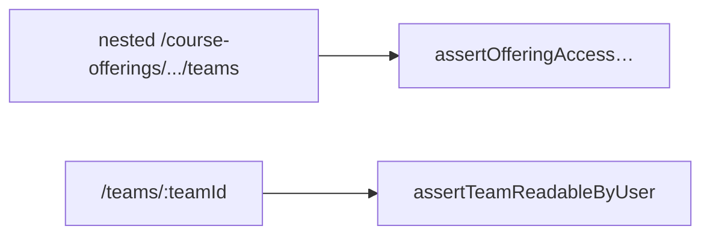

# Teams (`src/teams/`)

## Overview

Collaborative **`Team`** workspaces bound to **`CourseOffering`**. Routes split between **offering-context collections** (**nested listing + creation**) and **aggregate team operations by id**.

Authorization pairs **`authorization/courseOfferingGuards`** with **`authorization/teamAccess`** (see **[authorization](./authorization.md)**) so nested **`/course-offerings/:offeringId/...`** routes and aggregate **`/teams/:teamId`** routes stay coherent.

Responses may redact teammate PII for non-privileged callers—follow existing controller branches when returning member lists.

## File layout

| File | Responsibility |
|------|----------------|
| [`teamRouter.ts`](../src/teams/teamRouter.ts) | **`/teams/:teamId` aggregate subtree** |
| [`teamController.ts`](../src/teams/teamController.ts) | Both nested imports + aggregates |
| [`teamService.ts`](../src/teams/teamService.ts) | Team/member transactional helpers (**cleanup**, membership diffs) |
| [`team.schema.ts`](../src/teams/team.schema.ts) | Param + body schemas (**create/update/add members**) |

Nested routes live in [`courseOfferingRouter.ts`](../src/courseOfferings/courseOfferingRouter.ts) invoking same controller exports.

Preferred project augmentation often consults **`projectUtils`** (**[utils](./utils.md)**).

## How it fits

| Router mount | Responsibility |
|--------------|----------------|
| `/teams` (**`teamRouter`**) | `GET|PUT|DELETE /:teamId`, membership `POST`, membership `DELETE` |
| `/course-offerings/:offeringId/teams` (**`courseOfferingRouter`**) | Listing, creation, **`/me`** convenience |

Spark & enrollment modules reference teams indirectly (**IDs** propagate).

Deleting teams should cleanup Docker resources (**`containerService`**)—verify **`teamService`** flows when pruning.

## API surface recap

### Aggregate (`/teams`)

| Method | Path | Validates |
|--------|------|-----------|
| `GET` | `/:teamId` | **`teamParamsSchema`** |
| `PUT` | `/:teamId` | params + **`updateTeamSchema`** |
| `DELETE` | `/:teamId` | params |
| `POST` | `/:teamId/members` | params + **`addTeamMembersSchema`** |
| `DELETE` | `/:teamId/members/:userId` | **`teamMemberParamsSchema`** |

### Nested (`/course-offerings/:offeringId`)

| Method | Relative path |
|--------|---------------|
| `GET|POST` | `/teams` |
| `GET` | `/teams/me` |

(Each uses **`courseOfferingTeamsParamsSchema`** combos.)

### Authorization expectations (pattern-level)

| Operation | Typical guard helpers |
|-----------|-----------------------|
| Read listing/details | **`assertOfferingAccessForUser`** + **`assertTeamReadableByUser`** combos |
| Mutations (**create/update/delete/members**) | **`assertInstructorOrAdmin`** or teaching staff parallels (**see controllers**) |

For dual-id routes (`teamId + offeringId`) apply **`assertTeamBelongsToOffering`**.

## Development guide

1. Choose URL shape (**nested under an offering vs aggregate `/teams/:id`**) depending on UX; nesting carries **`offeringId`** for collection actions—see **[courseOfferings](./courseOfferings.md)** and **`authorization`** helpers above.
2. Extend **`team.schema.ts`** for payload validation.
3. For complicated membership mutation, augment **`teamService`** with transactional **`prisma.$transaction`** blocks.
4. When returning teams with projects, reuse **`getTeamPreferredProject`** for consistency (**avoid divergent sorting**).

## Testing

| File |
|------|
| [`test/teams/teamRouter.http.test.ts`](../test/teams/teamRouter.http.test.ts) |
| [`test/teams/teamService.test.ts`](../test/teams/teamService.test.ts) |
| [`test/authorization/teamAccess.test.ts`](../test/authorization/teamAccess.test.ts) |

## Related docs

- [authorization.md](./authorization.md)
- [courseOfferings.md](./courseOfferings.md)
- [projects.md](./projects.md)
- [enrollment.md](./enrollment.md)
